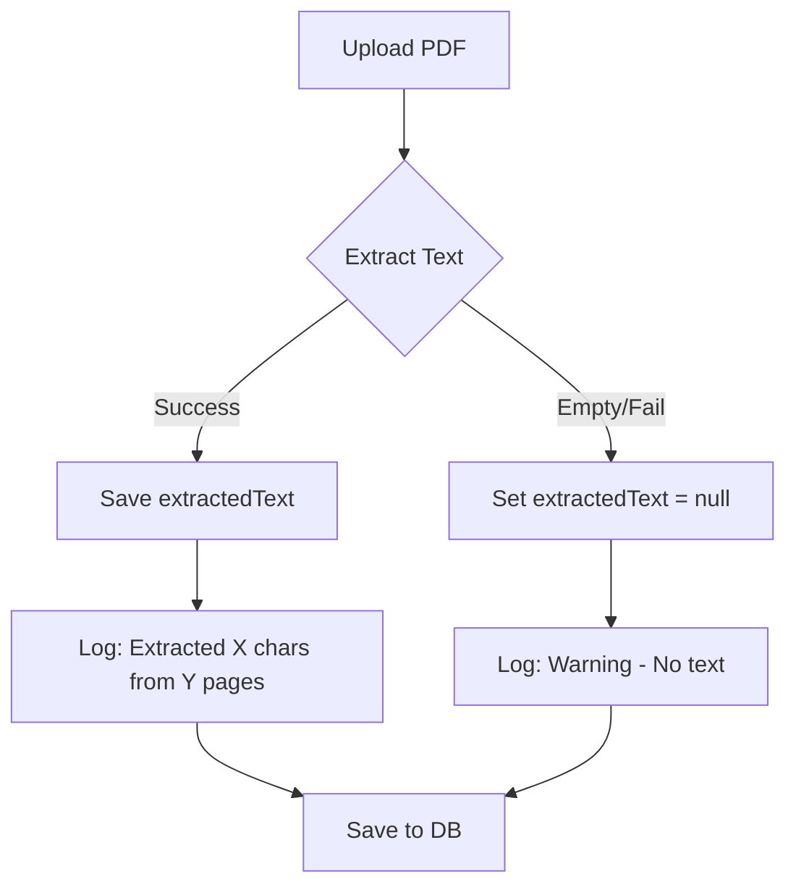
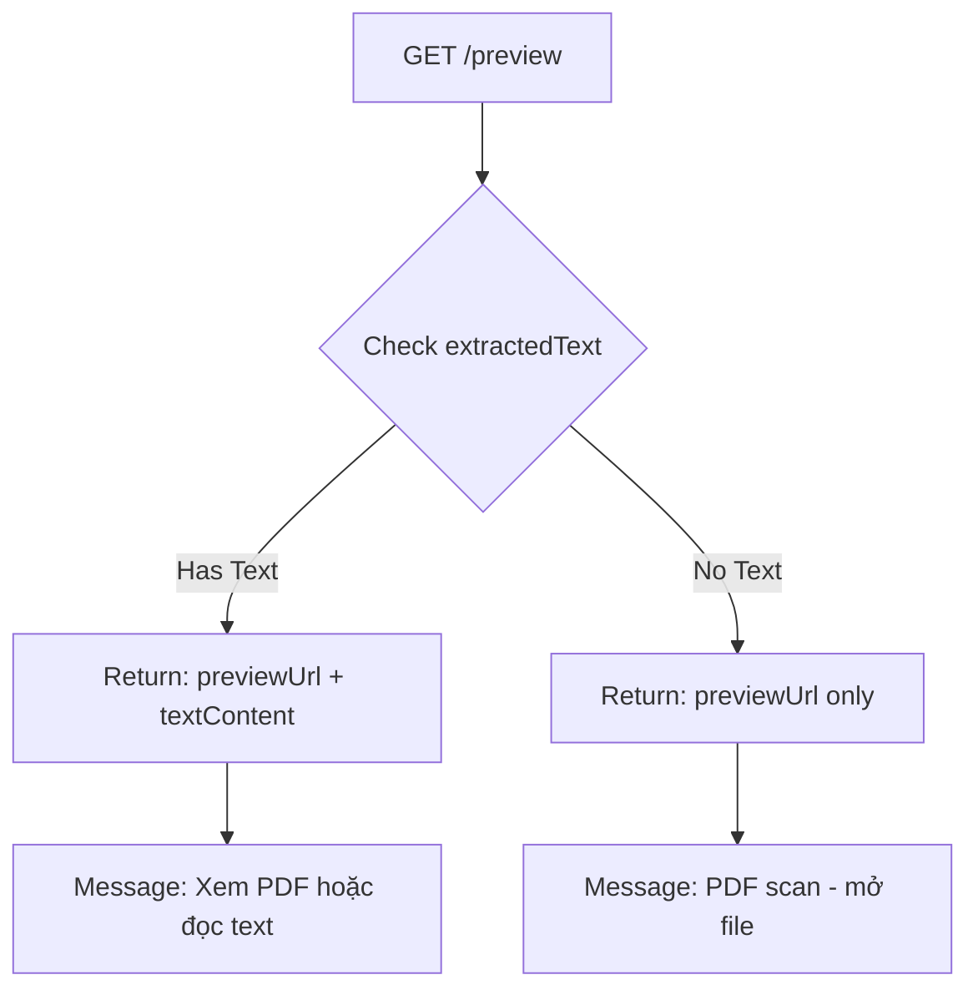

# 📄 PDF Preview Fix - Giải Quyết Vấn Đề Text Extraction

## ✅ Đã Fix

### Vấn đề ban đầu:
```
Xem trước: 
Hệ thống lưu trữ (Cloudinary) không cho phép xem trước định dạng PDF này trực tiếp.
Dưới đây là nội dung dạng văn bản (text) được trích xuất.
Vui lòng tải xuống để xem bản gốc.
Không có nội dung để xem trước.
```

### Root Causes:

1. **Missing PDF handling:** Logic không xử lý riêng PDF preview mode
2. **Confusing message:** Nói lỗi Cloudinary nhưng thực tế là PDF không có text
3. **No extraction feedback:** Không log chi tiết về text extraction

---

## 🔧 Changes Made

### 1. Added PDF Preview Mode Handler

**File:** `DocumentService.java` (lines ~248-260)

**Before:**
```java
if (PreviewMode.TEXT.equals(previewMode)) {
    // handle text
} else if (PreviewMode.UNSUPPORTED.equals(previewMode)) {
    // handle unsupported
}
// PDF không được handle riêng → fallback to generic
```

**After:**
```java
if (PreviewMode.TEXT.equals(previewMode)) {
    // handle text files
} else if (PreviewMode.PDF.equals(previewMode)) {
    previewSupported = true;
    if (StringUtils.hasText(doc.getExtractedText())) {
        textContent = doc.getExtractedText();
        if (textContent.length() > TEXT_PREVIEW_LIMIT) {
            textContent = textContent.substring(0, TEXT_PREVIEW_LIMIT);
            truncated = true;
        }
        message = "Bạn có thể xem PDF trực tiếp hoặc đọc nội dung văn bản bên dưới.";
    } else {
        message = "File PDF không chứa văn bản (có thể là scan ảnh). Vui lòng mở file để xem.";
    }
} else if (PreviewMode.UNSUPPORTED.equals(previewMode)) {
    // handle unsupported
}
```

### 2. Improved Text Extraction Logging

**File:** `DocumentService.java` (lines ~63-85)

**Added detailed logging:**
```java
if (PreviewMode.PDF.equals(previewMode)) {
    try (PDDocument pdDoc = Loader.loadPDF(file.getBytes())) {
        PDFTextStripper stripper = new PDFTextStripper();
        extractedText = stripper.getText(pdDoc);
        
        if (extractedText != null && !extractedText.trim().isEmpty()) {
            log.info("Extracted {} chars from {} pages PDF: {}", 
                    extractedText.length(), pdDoc.getNumberOfPages(), file.getOriginalFilename());
        } else {
            log.warn("PDF has no extractable text (might be scanned image): {}", file.getOriginalFilename());
            extractedText = null;
        }
    }
}
```

### 3. Better User Messages

**Old message (confusing):**
```
Hệ thống lưu trữ (Cloudinary) không cho phép xem trước định dạng PDF này trực tiếp.
```

**New messages (clear):**

**Case 1: PDF có text**
```
Bạn có thể xem PDF trực tiếp hoặc đọc nội dung văn bản bên dưới.
```

**Case 2: PDF scan (no text)**
```
File PDF không chứa văn bản (có thể là scan ảnh). Vui lòng mở file để xem.
```

---

## 📊 PDF Preview Flow

### Upload Phase



### Preview Phase



---

## 🎯 Preview API Response

### Case 1: PDF với Text (AI-ready)

**Request:**
```bash
GET /api/v1/documents/{id}/preview
Authorization: Bearer {JWT}
```

**Response:**
```json
{
  "code": 0,
  "message": "success",
  "data": {
    "documentId": "uuid",
    "fileName": "document.pdf",
    "fileType": "application/pdf",
    "previewUrl": "https://res.cloudinary.com/.../document.pdf",
    "previewSupported": true,
    "previewMode": "PDF",
    "textContent": "Extracted text content here...",
    "truncated": false,
    "aiSupported": true,
    "message": "Bạn có thể xem PDF trực tiếp hoặc đọc nội dung văn bản bên dưới."
  }
}
```

**Frontend Display:**
```jsx
<div>
  {/* Option 1: PDF Viewer */}
  <PDFViewer url={preview.previewUrl} />
  
  {/* Option 2: Extracted Text */}
  <div className="text-content">
    <h3>Nội dung văn bản:</h3>
    <pre>{preview.textContent}</pre>
  </div>
  
  {/* Option 3: AI Chat */}
  {preview.aiSupported && (
    <button>💬 Hỏi AI về tài liệu</button>
  )}
</div>
```

---

### Case 2: PDF Scan (No Text - Image PDF)

**Response:**
```json
{
  "documentId": "uuid",
  "fileName": "scanned.pdf",
  "fileType": "application/pdf",
  "previewUrl": "https://res.cloudinary.com/.../scanned.pdf",
  "previewSupported": true,
  "previewMode": "PDF",
  "textContent": null,
  "truncated": false,
  "aiSupported": false,
  "message": "File PDF không chứa văn bản (có thể là scan ảnh). Vui lòng mở file để xem."
}
```

**Frontend Display:**
```jsx
<div>
  <PDFViewer url={preview.previewUrl} />
  
  <div className="info-banner">
    ℹ️ {preview.message}
  </div>
  
  {/* No AI button - aiSupported is false */}
  
  <a href={preview.previewUrl} download>
    📥 Tải xuống PDF
  </a>
</div>
```

---

## 🧪 Testing

### Test Case 1: PDF with Text

```bash
# Upload text-based PDF
curl -X POST http://localhost:8081/api/v1/documents/upload \
  -H "Authorization: Bearer {JWT}" \
  -F "file=@text-based.pdf" \
  -F 'request={"title":"Text PDF"};type=application/json'

# Check logs - should see:
# INFO: Extracted 5432 chars from 10 pages PDF: text-based.pdf

# Get preview
curl -X GET "http://localhost:8081/api/v1/documents/{id}/preview" \
  -H "Authorization: Bearer {JWT}"

# Verify response:
# - previewSupported: true
# - textContent: (có nội dung)
# - aiSupported: true
# - message: "Bạn có thể xem PDF trực tiếp..."
```

### Test Case 2: Scanned PDF (Image)

```bash
# Upload scanned PDF
curl -X POST http://localhost:8081/api/v1/documents/upload \
  -H "Authorization: Bearer {JWT}" \
  -F "file=@scanned.pdf" \
  -F 'request={"title":"Scanned PDF"};type=application/json'

# Check logs - should see:
# WARN: PDF has no extractable text (might be scanned image): scanned.pdf

# Get preview
curl -X GET "http://localhost:8081/api/v1/documents/{id}/preview" \
  -H "Authorization: Bearer {JWT}"

# Verify response:
# - previewSupported: true
# - textContent: null
# - aiSupported: false
# - message: "File PDF không chứa văn bản..."
```

### Test Case 3: Corrupted PDF

```bash
# Upload corrupted/invalid PDF
curl -X POST http://localhost:8081/api/v1/documents/upload \
  -H "Authorization: Bearer {JWT}" \
  -F "file=@corrupted.pdf" \
  -F 'request={"title":"Bad PDF"};type=application/json'

# Check logs - should see:
# ERROR: Failed to extract text from file corrupted.pdf. Error: ...

# Upload should still succeed (extraction failure doesn't break upload)
# Preview will show: textContent = null, aiSupported = false
```

---

## 📱 Frontend Implementation

### Complete PDF Preview Component

```jsx
import React, { useState, useEffect } from 'react';
import { Document, Page, pdfjs } from 'react-pdf';
import 'react-pdf/dist/esm/Page/AnnotationLayer.css';
import 'react-pdf/dist/esm/Page/TextLayer.css';

// Configure PDF.js worker
pdfjs.GlobalWorkerOptions.workerSrc = `//cdnjs.cloudflare.com/ajax/libs/pdf.js/${pdfjs.version}/pdf.worker.min.js`;

function PDFPreview({ documentId, token }) {
  const [preview, setPreview] = useState(null);
  const [numPages, setNumPages] = useState(null);
  const [pageNumber, setPageNumber] = useState(1);
  const [showText, setShowText] = useState(false);
  const [loading, setLoading] = useState(true);

  useEffect(() => {
    fetch(`/api/v1/documents/${documentId}/preview`, {
      headers: { 'Authorization': `Bearer ${token}` }
    })
    .then(res => res.json())
    .then(data => {
      setPreview(data.data);
      setLoading(false);
    });
  }, [documentId, token]);

  const onDocumentLoadSuccess = ({ numPages }) => {
    setNumPages(numPages);
  };

  if (loading) return <div>Đang tải preview...</div>;
  if (!preview || !preview.previewSupported) {
    return <div>Không thể preview PDF này</div>;
  }

  return (
    <div className="pdf-preview">
      {/* Info Banner */}
      {preview.message && (
        <div className={`banner ${preview.aiSupported ? 'success' : 'info'}`}>
          {preview.message}
        </div>
      )}

      {/* View Toggle (if has text) */}
      {preview.textContent && (
        <div className="view-toggle">
          <button 
            onClick={() => setShowText(false)}
            className={!showText ? 'active' : ''}
          >
            📄 Xem PDF
          </button>
          <button 
            onClick={() => setShowText(true)}
            className={showText ? 'active' : ''}
          >
            📝 Xem Text
          </button>
        </div>
      )}

      {/* PDF Viewer */}
      {!showText && (
        <div className="pdf-viewer">
          <Document 
            file={preview.previewUrl}
            onLoadSuccess={onDocumentLoadSuccess}
            loading={<div>Đang tải PDF...</div>}
            error={<div>Lỗi tải PDF. <a href={preview.previewUrl} download>Tải xuống</a></div>}
          >
            <Page 
              pageNumber={pageNumber}
              width={800}
              renderTextLayer={true}
              renderAnnotationLayer={true}
            />
          </Document>

          {/* Pagination */}
          {numPages > 1 && (
            <div className="pagination">
              <button 
                disabled={pageNumber <= 1}
                onClick={() => setPageNumber(pageNumber - 1)}
              >
                ← Trước
              </button>
              <span>Trang {pageNumber} / {numPages}</span>
              <button 
                disabled={pageNumber >= numPages}
                onClick={() => setPageNumber(pageNumber + 1)}
              >
                Sau →
              </button>
            </div>
          )}
        </div>
      )}

      {/* Text Content View */}
      {showText && preview.textContent && (
        <div className="text-viewer">
          <pre className="text-content">{preview.textContent}</pre>
          {preview.truncated && (
            <p className="truncate-notice">
              ⚠️ Chỉ hiển thị 50,000 ký tự đầu tiên.
              <a href={preview.previewUrl} download>Tải PDF đầy đủ</a>
            </p>
          )}
        </div>
      )}

      {/* AI Chat Button */}
      {preview.aiSupported && (
        <button 
          className="ai-chat-btn"
          onClick={() => openAIChat(documentId)}
        >
          💬 Hỏi AI về tài liệu này
        </button>
      )}

      {/* Download Button */}
      <a 
        href={preview.previewUrl} 
        download={preview.fileName}
        className="download-btn"
      >
        📥 Tải xuống
      </a>
    </div>
  );
}

export default PDFPreview;
```

---

## 🔍 Debugging PDF Issues

### Check Server Logs

**Successful text extraction:**
```
INFO  c.e.s.a.f.d.s.DocumentService - Extracted 12345 chars from 25 pages PDF: document.pdf
```

**Scanned PDF (no text):**
```
WARN  c.e.s.a.f.d.s.DocumentService - PDF has no extractable text (might be scanned image): scanned.pdf
```

**Extraction failed:**
```
ERROR c.e.s.a.f.d.s.DocumentService - Failed to extract text from file corrupted.pdf. Error: Invalid PDF structure
```

### Check Database

```sql
-- Verify extractedText was saved
SELECT id, title, file_type, 
       CASE 
         WHEN extracted_text IS NULL THEN 'No text'
         WHEN LEN(extracted_text) = 0 THEN 'Empty text'
         ELSE CONCAT(LEN(extracted_text), ' chars')
       END as text_status
FROM documents
WHERE file_type = 'application/pdf'
ORDER BY created_at DESC;
```

---

## 💡 Future Enhancements

### 1. OCR for Scanned PDFs

```java
// Detect scanned PDF and run OCR
if (isScannedPdf(pdDoc)) {
    extractedText = ocrService.extractText(file);
}
```

**Suggested libraries:**
- Tesseract OCR
- Google Cloud Vision API
- AWS Textract

### 2. PDF Thumbnail Generation

```java
// Generate thumbnail from first page
BufferedImage thumbnail = pdfRenderer.renderImageWithDPI(0, 150);
String thumbnailUrl = cloudinaryService.uploadImage(thumbnail);
doc.setThumbnailUrl(thumbnailUrl);
```

### 3. Metadata Extraction

```java
PDDocumentInformation info = pdDoc.getDocumentInformation();
doc.setAuthor(info.getAuthor());
doc.setCreationDate(info.getCreationDate());
doc.setKeywords(info.getKeywords());
```

---

## ✅ Summary

### Fixed Issues:
- ✅ PDF preview mode now handled correctly
- ✅ Clear messages for text vs scanned PDFs
- ✅ Better logging for debugging
- ✅ Proper null handling for extractedText

### User Experience:
- ✅ Can view PDF directly in browser
- ✅ Can read extracted text if available
- ✅ Clear indication if PDF is scanned image
- ✅ AI chat enabled only for text-based PDFs

### Developer Experience:
- ✅ Detailed logs for troubleshooting
- ✅ Graceful fallback for extraction failures
- ✅ Easy to identify scanned vs text PDFs

**Next:** Deploy and test with real PDF files!
