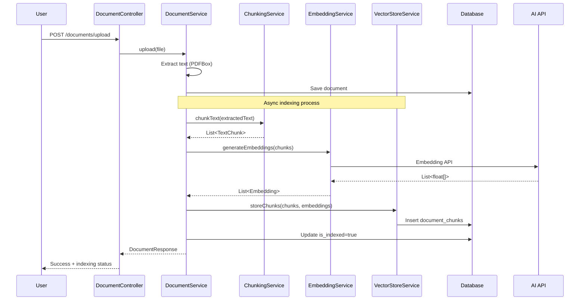
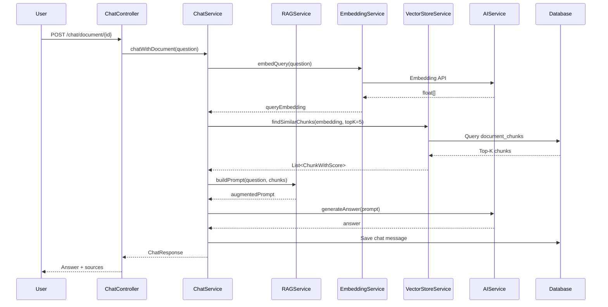

# 🤖 RAG System Design - AI Student Hub

**Retrieval-Augmented Generation for Document Q&A**

---

## 📋 Executive Summary

**Goal:** Cho phép sinh viên hỏi đáp về tài liệu đã upload bằng AI, với câu trả lời dựa trên nội dung thực tế của tài liệu.

**Approach:** RAG (Retrieval-Augmented Generation)
1. **Chunk** document thành các đoạn nhỏ
2. **Embed** chunks thành vectors
3. **Retrieve** relevant chunks khi có câu hỏi
4. **Generate** answer từ AI dựa trên chunks

**Tech Stack:**
- Chunking: LangChain4j hoặc custom logic
- Embeddings: OpenAI/Gemini Embedding API
- Vector Store: In-memory (MVP) → Pinecone/Qdrant (Production)
- LLM: OpenAI/Gemini Chat API

---

## 🏗️ System Architecture

```
┌─────────────────────────────────────────────────────────────┐
│                         USER                                 │
└────────────────┬────────────────────────────────────────────┘
                 │
                 ▼
┌─────────────────────────────────────────────────────────────┐
│                    FRONTEND                                  │
│  - Upload Document                                           │
│  - Ask Question                                              │
│  - View Answer + Sources                                     │
└────────────────┬────────────────────────────────────────────┘
                 │
                 ▼
┌─────────────────────────────────────────────────────────────┐
│                   BACKEND API                                │
│  ┌──────────────────────────────────────────────────┐       │
│  │         Document Upload Flow                     │       │
│  │  1. Upload file → Cloudinary                     │       │
│  │  2. Extract text (PDFBox)                        │       │
│  │  3. Chunk text (ChunkingService)                 │       │
│  │  4. Generate embeddings (EmbeddingService)       │       │
│  │  5. Store chunks + embeddings (VectorStore)      │       │
│  └──────────────────────────────────────────────────┘       │
│                                                               │
│  ┌──────────────────────────────────────────────────┐       │
│  │         Question Answering Flow                  │       │
│  │  1. Receive question                             │       │
│  │  2. Embed question (EmbeddingService)            │       │
│  │  3. Retrieve top-K chunks (VectorStore)          │       │
│  │  4. Build prompt with context (RAGService)       │       │
│  │  5. Generate answer (AIService)                  │       │
│  │  6. Return answer + source chunks                │       │
│  └──────────────────────────────────────────────────┘       │
└────────────────┬────────────────────────────────────────────┘
                 │
                 ▼
┌─────────────────────────────────────────────────────────────┐
│              EXTERNAL SERVICES                               │
│  - OpenAI API (Embeddings + Chat)                           │
│  - Gemini API (Embeddings + Chat)                           │
│  - Cloudinary (File Storage)                                 │
└─────────────────────────────────────────────────────────────┘
```

---

## 📊 Database Schema

### 1. documents (existing)
```sql
CREATE TABLE documents (
    id UNIQUEIDENTIFIER PRIMARY KEY,
    user_id UNIQUEIDENTIFIER NOT NULL,
    title NVARCHAR(255) NOT NULL,
    file_url VARCHAR(2000) NOT NULL,
    file_type VARCHAR(100),
    extracted_text NVARCHAR(MAX),
    -- RAG specific fields
    is_indexed BIT DEFAULT 0,
    chunk_count INT DEFAULT 0,
    indexed_at DATETIME2,
    embedding_model VARCHAR(100),
    created_at DATETIME2 NOT NULL,
    updated_at DATETIME2 NOT NULL,
    deleted_at DATETIME2
);
```

### 2. document_chunks (new)
```sql
CREATE TABLE document_chunks (
    id UNIQUEIDENTIFIER PRIMARY KEY DEFAULT NEWID(),
    document_id UNIQUEIDENTIFIER NOT NULL,
    chunk_index INT NOT NULL,
    content NVARCHAR(MAX) NOT NULL,
    -- Embedding stored as JSON for flexibility
    embedding NVARCHAR(MAX), -- JSON array of floats
    token_count INT,
    start_position INT,
    end_position INT,
    created_at DATETIME2 DEFAULT GETDATE(),
    FOREIGN KEY (document_id) REFERENCES documents(id) ON DELETE CASCADE,
    INDEX idx_document_chunks_doc_id (document_id),
    INDEX idx_document_chunks_doc_chunk (document_id, chunk_index)
);
```

### 3. chat_sessions (existing - enhanced)
```sql
CREATE TABLE chat_sessions (
    id UNIQUEIDENTIFIER PRIMARY KEY,
    user_id UNIQUEIDENTIFIER NOT NULL,
    document_id UNIQUEIDENTIFIER, -- NULL for general chat
    title NVARCHAR(255),
    created_at DATETIME2 NOT NULL,
    updated_at DATETIME2 NOT NULL,
    FOREIGN KEY (document_id) REFERENCES documents(id) ON DELETE SET NULL
);
```

### 4. chat_messages (existing - enhanced)
```sql
CREATE TABLE chat_messages (
    id UNIQUEIDENTIFIER PRIMARY KEY,
    session_id UNIQUEIDENTIFIER NOT NULL,
    sender VARCHAR(20) NOT NULL, -- USER, ASSISTANT, SYSTEM
    message_content NVARCHAR(MAX) NOT NULL,
    -- RAG metadata
    source_chunks NVARCHAR(MAX), -- JSON array of chunk IDs
    token_count INT,
    created_at DATETIME2 DEFAULT GETDATE(),
    FOREIGN KEY (session_id) REFERENCES chat_sessions(id) ON DELETE CASCADE
);
```

---

## 🔄 Data Flow

### Flow 1: Document Indexing (Upload Time)



### Flow 2: Question Answering (Query Time)



---

## 🧩 Core Components

### 1. ChunkingService

**Purpose:** Split document text into manageable chunks

**Strategy:**
- **Fixed size:** 500-1000 tokens per chunk
- **Overlap:** 100-200 tokens between chunks
- **Boundary aware:** Don't split mid-sentence

```java
public interface ChunkingService {
    List<TextChunk> chunkText(String text, ChunkingStrategy strategy);
}

public class TextChunk {
    private String content;
    private int startPosition;
    private int endPosition;
    private int tokenCount;
}

public enum ChunkingStrategy {
    FIXED_SIZE,      // 500 tokens, 100 overlap
    PARAGRAPH,       // By paragraphs
    SENTENCE         // By sentences
}
```

**Implementation:**
```java
@Service
public class ChunkingServiceImpl implements ChunkingService {
    
    private static final int CHUNK_SIZE = 800; // tokens
    private static final int OVERLAP = 150;
    
    @Override
    public List<TextChunk> chunkText(String text, ChunkingStrategy strategy) {
        switch (strategy) {
            case FIXED_SIZE:
                return chunkByFixedSize(text);
            case PARAGRAPH:
                return chunkByParagraph(text);
            default:
                return chunkByFixedSize(text);
        }
    }
    
    private List<TextChunk> chunkByFixedSize(String text) {
        // Tokenize text
        String[] words = text.split("\\s+");
        List<TextChunk> chunks = new ArrayList<>();
        
        int start = 0;
        while (start < words.length) {
            int end = Math.min(start + CHUNK_SIZE, words.length);
            
            // Find sentence boundary
            while (end < words.length && !words[end].endsWith(".")) {
                end++;
            }
            
            String chunkContent = String.join(" ", 
                Arrays.copyOfRange(words, start, end));
            
            chunks.add(new TextChunk(
                chunkContent,
                start,
                end,
                end - start
            ));
            
            start = end - OVERLAP; // Overlap
        }
        
        return chunks;
    }
}
```

---

### 2. EmbeddingService

**Purpose:** Convert text to vector embeddings

**Models:**
- OpenAI: `text-embedding-3-small` (1536 dims, cheap)
- OpenAI: `text-embedding-3-large` (3072 dims, better)
- Gemini: `embedding-001` (768 dims)

```java
public interface EmbeddingService {
    float[] embed(String text);
    List<float[]> embedBatch(List<String> texts);
    int getDimensions();
}

@Service
public class OpenAIEmbeddingService implements EmbeddingService {
    
    @Value("${ai.embedding.model:text-embedding-3-small}")
    private String model;
    
    @Value("${ai.api-key}")
    private String apiKey;
    
    private static final int DIMENSIONS = 1536;
    
    @Override
    public float[] embed(String text) {
        // Call OpenAI Embeddings API
        // POST https://api.openai.com/v1/embeddings
        // Body: { "model": "text-embedding-3-small", "input": "text" }
        
        HttpRequest request = HttpRequest.newBuilder()
            .uri(URI.create("https://api.openai.com/v1/embeddings"))
            .header("Authorization", "Bearer " + apiKey)
            .header("Content-Type", "application/json")
            .POST(HttpRequest.BodyPublishers.ofString(buildPayload(text)))
            .build();
        
        HttpResponse<String> response = httpClient.send(request);
        // Parse response and extract embedding vector
        return parseEmbedding(response.body());
    }
    
    @Override
    public int getDimensions() {
        return DIMENSIONS;
    }
}
```

---

### 3. VectorStoreService

**Purpose:** Store and retrieve embeddings

**MVP Implementation:** In-Memory with SQL fallback

```java
public interface VectorStoreService {
    void storeChunks(UUID documentId, List<ChunkWithEmbedding> chunks);
    List<ChunkWithScore> findSimilar(float[] queryEmbedding, UUID documentId, int topK);
    void deleteByDocumentId(UUID documentId);
}

@Service
public class InMemoryVectorStore implements VectorStoreService {
    
    private final DocumentChunkRepository chunkRepository;
    
    @Override
    public void storeChunks(UUID documentId, List<ChunkWithEmbedding> chunks) {
        List<DocumentChunk> entities = chunks.stream()
            .map(chunk -> DocumentChunk.builder()
                .documentId(documentId)
                .chunkIndex(chunk.getIndex())
                .content(chunk.getContent())
                .embedding(serializeEmbedding(chunk.getEmbedding()))
                .tokenCount(chunk.getTokenCount())
                .build())
            .collect(Collectors.toList());
        
        chunkRepository.saveAll(entities);
    }
    
    @Override
    public List<ChunkWithScore> findSimilar(
            float[] queryEmbedding, 
            UUID documentId, 
            int topK) {
        
        // Load all chunks for document
        List<DocumentChunk> chunks = 
            chunkRepository.findByDocumentId(documentId);
        
        // Calculate cosine similarity
        List<ChunkWithScore> scored = chunks.stream()
            .map(chunk -> {
                float[] embedding = deserializeEmbedding(chunk.getEmbedding());
                float score = cosineSimilarity(queryEmbedding, embedding);
                return new ChunkWithScore(chunk, score);
            })
            .sorted((a, b) -> Float.compare(b.getScore(), a.getScore()))
            .limit(topK)
            .collect(Collectors.toList());
        
        return scored;
    }
    
    private float cosineSimilarity(float[] a, float[] b) {
        float dotProduct = 0.0f;
        float normA = 0.0f;
        float normB = 0.0f;
        
        for (int i = 0; i < a.length; i++) {
            dotProduct += a[i] * b[i];
            normA += a[i] * a[i];
            normB += b[i] * b[i];
        }
        
        return dotProduct / (float)(Math.sqrt(normA) * Math.sqrt(normB));
    }
}
```

---

### 4. Enhanced RAGService

**Purpose:** Build context-aware prompts

```java
@Service
public class EnhancedRAGService {
    
    private final VectorStoreService vectorStore;
    private final EmbeddingService embeddingService;
    
    public RAGContext retrieveContext(UUID documentId, String question, int topK) {
        // 1. Embed question
        float[] queryEmbedding = embeddingService.embed(question);
        
        // 2. Find similar chunks
        List<ChunkWithScore> chunks = 
            vectorStore.findSimilar(queryEmbedding, documentId, topK);
        
        // 3. Filter by relevance threshold
        List<ChunkWithScore> relevant = chunks.stream()
            .filter(c -> c.getScore() > 0.7f) // Similarity threshold
            .collect(Collectors.toList());
        
        return new RAGContext(question, relevant);
    }
    
    public String buildPrompt(RAGContext context) {
        StringBuilder prompt = new StringBuilder();
        
        prompt.append("System:\n");
        prompt.append("Bạn là AI Study Assistant. ");
        prompt.append("Trả lời câu hỏi dựa CHÍNH XÁC vào tài liệu dưới đây.\n\n");
        
        prompt.append("Tài liệu liên quan:\n");
        prompt.append("---\n");
        
        for (int i = 0; i < context.getChunks().size(); i++) {
            ChunkWithScore chunk = context.getChunks().get(i);
            prompt.append(String.format("[Đoạn %d] (Độ liên quan: %.2f)\n", 
                i + 1, chunk.getScore()));
            prompt.append(chunk.getContent());
            prompt.append("\n\n");
        }
        
        prompt.append("---\n\n");
        prompt.append("Câu hỏi: ").append(context.getQuestion()).append("\n\n");
        prompt.append("Hướng dẫn:\n");
        prompt.append("- Trả lời dựa trên các đoạn tài liệu trên\n");
        prompt.append("- Trích dẫn [Đoạn X] khi reference\n");
        prompt.append("- Nếu không có thông tin, nói rõ 'Tài liệu không đề cập'\n");
        prompt.append("- Trả lời ngắn gọn, rõ ràng\n\n");
        prompt.append("Trả lời:\n");
        
        return prompt.toString();
    }
}
```

---

## 📡 API Endpoints

### 1. Index Document (Async)

```
POST /api/v1/documents/{id}/index
Authorization: Bearer {JWT}

Response:
{
  "code": 0,
  "message": "Document indexing started",
  "data": {
    "documentId": "uuid",
    "status": "INDEXING",
    "estimatedTime": "30 seconds"
  }
}
```

### 2. Check Index Status

```
GET /api/v1/documents/{id}/index-status
Authorization: Bearer {JWT}

Response:
{
  "data": {
    "documentId": "uuid",
    "isIndexed": true,
    "chunkCount": 25,
    "embeddingModel": "text-embedding-3-small",
    "indexedAt": "2026-06-06T22:30:00Z"
  }
}
```

### 3. Ask Question

```
POST /api/v1/chat/document/{documentId}
Authorization: Bearer {JWT}
Content-Type: application/json

{
  "message": "Chương 3 nói về gì?",
  "sessionId": "optional-uuid",
  "topK": 5
}

Response:
{
  "data": {
    "answer": "Chương 3 trình bày về...",
    "sources": [
      {
        "chunkIndex": 5,
        "content": "Excerpt from chunk...",
        "score": 0.89
      }
    ],
    "sessionId": "uuid",
    "messageId": "uuid"
  }
}
```

### 4. Ask with Streaming

```
POST /api/v1/chat/document/{documentId}/stream
Authorization: Bearer {JWT}
Content-Type: application/json
Accept: text/event-stream

{
  "message": "Giải thích khái niệm X",
  "sessionId": "optional-uuid"
}

Response (SSE):
event: sources
data: {"chunks": [...]}

event: token
data: {"content": "Khái"}

event: token
data: {"content": " niệm"}

event: done
data: {"messageId": "uuid"}
```

---

## 🎯 Performance Optimization

### 1. Caching

```java
@Cacheable(value = "embeddings", key = "#text.hashCode()")
public float[] embed(String text) {
    // API call
}

@Cacheable(value = "chunks", key = "#documentId")
public List<DocumentChunk> getChunks(UUID documentId) {
    return chunkRepository.findByDocumentId(documentId);
}
```

### 2. Batch Processing

```java
// Instead of embedding one by one
for (TextChunk chunk : chunks) {
    float[] embedding = embeddingService.embed(chunk.getContent());
}

// Batch embed (cheaper & faster)
List<String> texts = chunks.stream()
    .map(TextChunk::getContent)
    .collect(Collectors.toList());
List<float[]> embeddings = embeddingService.embedBatch(texts);
```

### 3. Async Indexing

```java
@Async
public CompletableFuture<IndexingResult> indexDocument(UUID documentId) {
    // Long-running indexing process
    // User doesn't wait
}
```

---

## 💰 Cost Estimation

### OpenAI Pricing (as of 2026)

| Operation | Model | Cost | Example |
|-----------|-------|------|---------|
| Embedding | text-embedding-3-small | $0.02 / 1M tokens | 100-page PDF (~50K tokens) = $0.001 |
| Chat | gpt-4o-mini | $0.15 / 1M input + $0.60 / 1M output | 1000 questions = ~$0.50 |

**Monthly estimate (1000 students, 10 docs each, 100 questions):**
- Indexing: 10,000 docs × $0.001 = $10
- Questions: 100,000 × $0.0005 = $50
- **Total: ~$60/month**

---

## 🚀 Implementation Roadmap

### Phase 1: MVP (Week 1-2)
- [x] Basic RAG service (existing)
- [ ] ChunkingService (fixed size)
- [ ] OpenAI EmbeddingService
- [ ] In-memory VectorStore
- [ ] Enhanced RAGService
- [ ] Document indexing API
- [ ] Question answering API

### Phase 2: Production (Week 3-4)
- [ ] Async indexing with job queue
- [ ] Better chunking (paragraph-aware)
- [ ] Gemini embedding support
- [ ] Caching layer
- [ ] SSE streaming
- [ ] Source highlighting UI

### Phase 3: Scale (Future)
- [ ] External vector DB (Pinecone/Qdrant)
- [ ] Hybrid search (vector + keyword)
- [ ] Re-ranking model
- [ ] Multi-document chat
- [ ] Citation extraction

---

## 🧪 Testing Strategy

### Unit Tests
```java
@Test
void testChunking() {
    String text = "Long document...";
    List<TextChunk> chunks = chunkingService.chunkText(text);
    
    assertThat(chunks).isNotEmpty();
    assertThat(chunks.get(0).getTokenCount()).isLessThan(1000);
}

@Test
void testVectorSimilarity() {
    float[] v1 = {1, 0, 0};
    float[] v2 = {0.9f, 0.1f, 0};
    
    float similarity = vectorStore.cosineSimilarity(v1, v2);
    assertThat(similarity).isGreaterThan(0.8f);
}
```

### Integration Tests
```java
@Test
void testDocumentQA() {
    // Upload document
    Document doc = uploadTestDocument("test.pdf");
    
    // Index
    indexingService.indexDocument(doc.getId());
    
    // Ask question
    RAGResponse response = chatService.askDocument(
        doc.getId(), 
        "What is the main topic?"
    );
    
    assertThat(response.getAnswer()).isNotEmpty();
    assertThat(response.getSources()).isNotEmpty();
}
```

---

## 📚 References

- [RAG Tutorial](https://python.langchain.com/docs/tutorials/rag/)
- [OpenAI Embeddings](https://platform.openai.com/docs/guides/embeddings)
- [Gemini Embeddings](https://ai.google.dev/gemini-api/docs/embeddings)
- [Vector Search Best Practices](https://www.pinecone.io/learn/vector-search/)

---

**Next:** Implement core services → Test with real documents → Deploy MVP 🚀
